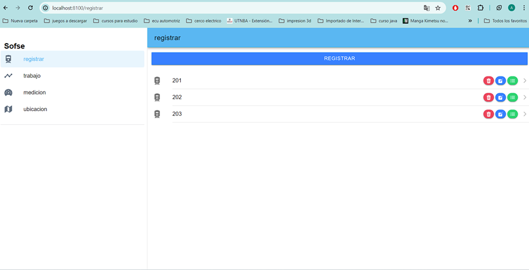
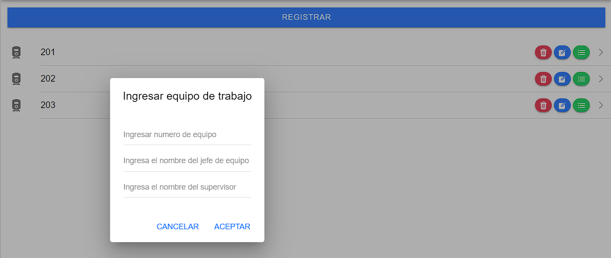

# Sistema de adquisición de datos para maquinaria pesada de vía
## Informacion general
Este proyecto se encarga de mostrar, guardar y graficar todos los datos de la geometría de vía entre 2 puntos.
1. Se tiene que registrar el equipo con los operarios.
2. Se van a mostrar todos los recorridos que equipo a realizado
3. Para un recorrido de medición se tiene cargar un nuevo recorrido(linea, vía, ramal, progresiva inicial, progresiva final y fecha).
4. Los datos son recibidos en tiempo real del y son guardados en una base de datos mysql.


## Tecnologia.
### frontend
1. Angular
2. Ionic
3. Utiliza la librería de charts para graficar
### BACKEND
1. Node.js version 10
2. Mysql version 5.7
3. Phpmyadmin 
### Broker MQTT 
emqx version 5.0.26
EMQX es un broker MQTT de código abierto altamente escalable y permite la creación de un cluster con múltiples nodos lo que facilita el manejo de miles de conexiones, EMQX permite su gestión a través de un dashboard muy completo e integra varios plugins que facilitan el manejo de usuarios y reglas para administrar los permisos de cada uno.
```
sistema_de_adquisición_de_datos/
│
├── backend/
│    ├── node_module/
│    ├── routes/
│    │   ├── medición
│    │   ├── mqtt
│    │   ├── trabajo
│    │   ├── carga-trabajo 
│    │   └── registrar
│    ├── IoInstance/   
│    │   └── index.js  
│    ├── index.js   	
│    ├── MySQL-connector.js
│    ├── package-lock.json
│    └── package.json
├── frontend/
│    ├── proyecto/
│    │    ├── node_module/
│    │    ├── src/
│    │    │    ├── App
│    │    │    │    ├── cargar-trabajo
│    │    │    │    ├── folder
│    │    │    │    ├── guards
│    │    │    │    ├── home
│    │    │    │    ├── interfaces
│    │    │    │    ├── trabajo
│    │    │    │    ├── services
│    │    │    │    └── cargar-trabajo
│    │    │    ├──assets/
│    │    │    ├──enviroments/
│    │    │    ├──theme/
│    │    │    ├──global.scss
│    │    │    ├──index.js
│    │    │    ├──main.js
│    │    │    ├──polyfill.ts
│    │    │    ├──test.ts
│    │    │    └──zone-flags.ts
│    │    ├──.browserlisttrc
│    │    ├──.editorconfig
│    │    ├──.eslintrc.json      
│    │    ├──angular.json
│    │    ├──capasitor.config.ts
│    │    ├──.editorconfig
│    │    ├──node_modules/
│    │    ├──ionic.config.ts
│    │    ├──karma.config.ts
│    │    ├──package-lock.json
│    │    ├──package.json  
│    │    ├──tsconsig.app.json
│    │    ├──tsconsig.spec.json          
│    │    ├──.vscode/
│    │    └──dockerfile 
├── docker-compose.yml
│
└── certificados/
    ├── server.crt
    └── server.key

```


